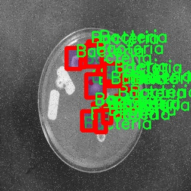

# 微生物菌落图像分割系统： yolov8-seg-slimneck

### 1.研究背景与意义

[参考博客](https://gitee.com/YOLOv8_YOLOv11_Segmentation_Studio/projects)

[博客来源](https://kdocs.cn/l/cszuIiCKVNis)

研究背景与意义

随着生物技术和微生物学的迅速发展，微生物菌落的图像分析在环境监测、食品安全、医学诊断等领域的应用日益广泛。微生物菌落的定量和定性分析不仅能够帮助科研人员了解微生物的多样性和生态功能，还能为疾病预防、公共卫生和生物制药等提供重要的科学依据。然而，传统的手动计数和分类方法不仅耗时耗力，而且容易受到人为因素的影响，导致结果的不准确性。因此，开发高效、准确的自动化图像分割和识别系统显得尤为重要。

近年来，深度学习技术的快速发展为图像处理领域带来了革命性的变化。尤其是基于卷积神经网络（CNN）的目标检测和分割算法，如YOLO（You Only Look Once）系列，因其高效性和准确性而广泛应用于各类图像分析任务。YOLOv8作为该系列的最新版本，具备了更强的特征提取能力和更快的处理速度，适合用于复杂背景下的微生物菌落图像分割。然而，现有的YOLOv8模型在微生物菌落图像分割任务中仍存在一些不足之处，如对小目标的检测能力不足、对不同种类菌落的分类准确性不高等。因此，基于YOLOv8的改进模型将有助于提升微生物菌落图像分割的效果。

本研究将基于“Colony Counter Dataset v1”数据集进行微生物菌落图像分割系统的开发。该数据集包含1300张图像，涵盖了10个类别，包括细菌、真菌、绿色、LAB、YCG、YGC、酵母、黄色和等级C等。这些类别的多样性为模型的训练和测试提供了丰富的样本，有助于提高模型的泛化能力。通过对这些图像进行实例分割，研究将能够实现对不同类型微生物菌落的精确识别和计数，为微生物学研究提供可靠的数据支持。

本研究的意义在于，首先，通过改进YOLOv8模型，能够提高微生物菌落图像分割的准确性和效率，解决传统方法在处理复杂背景和小目标时的局限性。其次，研究成果将为微生物菌落的自动化分析提供新的技术手段，推动相关领域的研究进展。此外，基于深度学习的图像分割系统的成功应用，能够为其他生物图像分析任务提供借鉴，促进计算机视觉技术在生物科学中的广泛应用。

综上所述，基于改进YOLOv8的微生物菌落图像分割系统的研究，不仅具有重要的理论价值，还有助于推动微生物学及相关领域的实际应用，具有广泛的社会和经济意义。通过该研究，期望能够为微生物菌落的自动化分析提供一个高效、准确的解决方案，为科学研究和实际应用提供更为坚实的基础。

### 2.图片演示


注意：本项目提供完整的训练源码数据集和训练教程,由于此博客编辑较早,暂不提供权重文件（best.pt）,需要按照6.训练教程进行训练后实现上图效果。

### 3.视频演示

[3.1 视频演示](https://www.bilibili.com/video/BV1uYByYCEz5/)

### 4.数据集信息

##### 4.1 数据集类别数＆类别名

nc: 2
names: ['Bacteria', 'Fungi']


##### 4.2 数据集信息简介

数据集信息展示

在微生物学的研究与应用中，菌落的准确识别与计数是至关重要的环节。为此，开发了一种基于YOLOv8-seg的微生物菌落图像分割系统，而该系统的训练依赖于“Colony Counter Dataset v1”这一数据集。该数据集专门为微生物菌落的自动化计数与分类而设计，包含了丰富的图像数据，能够有效支持深度学习模型的训练与验证。

“Colony Counter Dataset v1”数据集包含了两类主要的微生物菌落，分别是“Bacteria”（细菌）和“Fungi”（真菌）。这两类微生物在生态系统中扮演着重要的角色，细菌通常以其快速繁殖和广泛的生存能力而著称，而真菌则在分解有机物和形成生态平衡方面发挥着不可或缺的作用。数据集中对这两类微生物的图像进行了精心的标注，确保每个菌落的特征都能被准确捕捉。这种细致的标注不仅为模型提供了丰富的训练样本，也为后续的模型评估和性能提升奠定了基础。

在数据集的构建过程中，研究人员采集了多种不同环境下的菌落图像，确保数据的多样性和代表性。这些图像不仅涵盖了不同的培养基和生长条件，还考虑了不同的光照和拍摄角度，从而提高了模型在实际应用中的鲁棒性和适应性。每一张图像都经过严格的筛选与处理，以确保其质量和可用性，避免了噪声数据对模型训练的负面影响。

此外，数据集的规模也是其重要特征之一。为了实现高效的训练，数据集包含了大量的图像样本，使得模型能够学习到丰富的特征信息。每类微生物的样本数量经过精心设计，以确保模型在学习过程中不会出现类别不平衡的问题，从而提高了模型对不同类型菌落的识别能力。

在训练过程中，YOLOv8-seg模型将利用“Colony Counter Dataset v1”提供的图像数据，通过深度学习算法提取菌落的特征，并进行分割与分类。模型将通过反复迭代的方式，不断优化其参数，以提高对细菌和真菌的识别精度。最终，经过训练的模型将能够在新的图像中快速而准确地识别出菌落的种类与数量，为微生物学研究提供有力的技术支持。

综上所述，“Colony Counter Dataset v1”不仅是一个功能强大的训练数据集，它的设计理念和数据构建方法都充分考虑了微生物菌落图像分割的实际需求。通过利用这一数据集，研究人员能够有效地推动微生物计数的自动化进程，提升研究效率，并为未来的微生物学研究开辟新的方向。





### 5.项目依赖环境部署教程（零基础手把手教学）

[5.1 环境部署教程链接（零基础手把手教学）](https://www.bilibili.com/video/BV1jG4Ve4E9t/?vd_source=bc9aec86d164b67a7004b996143742dc)


[5.2 安装Python虚拟环境创建和依赖库安装视频教程链接（零基础手把手教学）](https://www.bilibili.com/video/BV1nA4VeYEze/?vd_source=bc9aec86d164b67a7004b996143742dc)

### 6.手把手YOLOV8-seg训练视频教程（零基础手把手教学）

[6.1 手把手YOLOV8-seg训练视频教程（零基础小白有手就能学会）](https://www.bilibili.com/video/BV1cA4VeYETe/?vd_source=bc9aec86d164b67a7004b996143742dc)


按照上面的训练视频教程链接加载项目提供的数据集，运行train.py即可开始训练



     Epoch   gpu_mem       box       obj       cls    labels  img_size
     1/200     0G   0.01576   0.01955  0.007536        22      1280: 100%|██████████| 849/849 [14:42<00:00,  1.04s/it]
               Class     Images     Labels          P          R     mAP@.5 mAP@.5:.95: 100%|██████████| 213/213 [01:14<00:00,  2.87it/s]
                 all       3395      17314      0.994      0.957      0.0957      0.0843

     Epoch   gpu_mem       box       obj       cls    labels  img_size
     2/200     0G   0.01578   0.01923  0.007006        22      1280: 100%|██████████| 849/849 [14:44<00:00,  1.04s/it]
               Class     Images     Labels          P          R     mAP@.5 mAP@.5:.95: 100%|██████████| 213/213 [01:12<00:00,  2.95it/s]
                 all       3395      17314      0.996      0.956      0.0957      0.0845

     Epoch   gpu_mem       box       obj       cls    labels  img_size
     3/200     0G   0.01561    0.0191  0.006895        27      1280: 100%|██████████| 849/849 [10:56<00:00,  1.29it/s]
               Class     Images     Labels          P          R     mAP@.5 mAP@.5:.95: 100%|███████   | 187/213 [00:52<00:00,  4.04it/s]
                 all       3395      17314      0.996      0.957      0.0957      0.0845


### 7.50+种全套YOLOV8-seg创新点加载调参实验视频教程（一键加载写好的改进模型的配置文件）

[7.1 50+种全套YOLOV8-seg创新点加载调参实验视频教程（一键加载写好的改进模型的配置文件）](https://www.bilibili.com/video/BV1Hw4VePEXv/?vd_source=bc9aec86d164b67a7004b996143742dc)

### YOLOV8-seg算法简介

原始YOLOv8-seg算法原理

YOLOv8-seg算法是Ultralytics公司在2023年推出的YOLO系列中的最新版本，它在前几代YOLO算法的基础上进行了多项重要的改进和优化，特别是在目标检测和图像分割的任务上展现了卓越的性能。YOLOv8-seg不仅延续了YOLO系列的高效性和准确性，还通过引入更深的卷积神经网络结构和创新的算法设计，进一步提升了模型的检测精度和处理速度。

YOLOv8-seg的核心思想是将整个图像作为输入，通过深度学习模型直接进行目标检测和分割，而不需要传统方法中的滑动窗口或区域提议。这种方法的优势在于它能够更快地处理图像，并且减少了信息损失。YOLOv8-seg在输入阶段采用了640x640的标准图像尺寸，但在实际应用中，它能够自适应地缩放输入图像，以适应不同的长宽比。这种自适应缩放不仅提高了目标检测的速度，还最大限度地减少了图像填充带来的信息冗余。

在数据预处理方面，YOLOv8-seg继续采用YOLOv5的策略，结合了多种数据增强技术，如马赛克增强、混合增强、空间扰动和颜色扰动。这些增强手段的引入使得模型在训练过程中能够接触到更多样化的样本，从而提高了模型的泛化能力和鲁棒性。特别是马赛克增强，通过将四张不同的图像拼接成一张新图像，迫使模型学习到不同位置和周围像素的特征，显著提升了预测精度。

YOLOv8-seg的骨干网络结构是其另一个重要的创新点。与YOLOv5相比，YOLOv8将C3模块替换为C2F模块，后者在设计上更加灵活，能够并行处理更多的梯度流分支。这种改进不仅增强了特征提取的能力，还提高了模型的整体性能。C2F模块的引入使得网络在处理复杂场景时能够更好地捕捉多尺度信息，从而提高了检测的准确性。

在特征融合方面，YOLOv8-seg依然采用了特征金字塔网络（FPN）和路径聚合网络（PAN）的结构，这种设计使得多尺度信息能够得到充分的融合。通过在不同尺度的特征图之间进行有效的信息传递，YOLOv8-seg能够在处理不同大小的目标时，保持较高的检测精度。

YOLOv8-seg的检测头结构也经历了显著的变化。与以往的耦合头（Coupled-Head）不同，YOLOv8-seg采用了解耦头（Decoupled-Head）结构。这种结构将分类和定位任务分开处理，分别通过两个独立的卷积层进行特征提取。这种解耦设计使得模型在进行目标检测时能够更专注于每个任务，从而提高了分类和定位的精度。

此外，YOLOv8-seg在标签分配策略上也进行了创新。以往的YOLO版本依赖于候选框的聚类，而YOLOv8-seg则采用了一种动态标签分配策略，能够根据目标的实际分布情况进行自适应调整。这种策略不仅提高了正负样本的匹配效率，还使得模型在训练过程中能够更好地关注高质量的样本，进一步提升了检测性能。

在损失函数的设计上，YOLOv8-seg引入了Varifocal Loss（VFL）和CIoULoss等新型损失函数。VFL通过对正负样本进行不对称加权，使得模型在训练时能够更关注高质量的正样本，从而提高了模型的整体性能。CIoULoss则在边界框回归中引入了更为精细的计算方法，使得模型在预测目标位置时更加准确。

综上所述，YOLOv8-seg算法通过多项创新和改进，显著提升了目标检测和图像分割的性能。其深度卷积神经网络结构、灵活的输入处理、有效的特征融合以及先进的损失函数设计，使得YOLOv8-seg在智能监控、自动驾驶和人脸识别等多种应用场景中展现出卓越的性能。随着YOLOv8-seg的广泛应用，未来的目标检测和图像分割任务将更加高效和准确，为各行各业带来更大的便利和可能性。


### 9.系统功能展示（检测对象为举例，实际内容以本项目数据集为准）

图9.1.系统支持检测结果表格显示

  图9.2.系统支持置信度和IOU阈值手动调节

  图9.3.系统支持自定义加载权重文件best.pt(需要你通过步骤5中训练获得)

  图9.4.系统支持摄像头实时识别

  图9.5.系统支持图片识别

  图9.6.系统支持视频识别

  图9.7.系统支持识别结果文件自动保存

  图9.8.系统支持Excel导出检测结果数据


### 10.50+种全套YOLOV8-seg创新点原理讲解（非科班也可以轻松写刊发刊，V11版本正在科研待更新）

#### 10.1 由于篇幅限制，每个创新点的具体原理讲解就不一一展开，具体见下列网址中的创新点对应子项目的技术原理博客网址【Blog】：


[10.1 50+种全套YOLOV8-seg创新点原理讲解链接](https://gitee.com/qunmasj/good)

#### 10.2 部分改进模块原理讲解(完整的改进原理见上图和技术博客链接)【如果此小节的图加载失败可以通过CSDN或者Github搜索该博客的标题访问原始博客，原始博客图片显示正常】
### YOLOv8简介
YOLOv8目标检测算法继承了YOLOv1系列的思考,是一种新型端到端的目标检测算法,尽管现在原始检测算法已经开源,但是鲜有发表的相关论文.YOLOv8的网络结构如图所示,主要可分为Input输入端、Backbone骨干神经网络、Neck 混合特征网络层和Head预测层网络共4个部分.

YOLO目标检测算法是一种端到端的One-Slage 目标检测算法，其核心思想是将图像按区域分块进行预测。YOLO将输入图像按照32x32的大小划分成若干个网格，例如416x416的图像将被划分为13x13个网格。当目标物体的中心位于某个网格内时,该网格就会负责输出该物体的边界框和类别置信度。每个网格可以预测多个边界框和多个目标类别,这些边界框和类别的数量可以根据需要进行设置。YOLO算法的输出是一个特征图,包含了每个网格对应的边界框和类别置信度的信息呵。本文采用YOLO最新的YOLOv8模型，其是2022年底发布的最新YOLO系列模型，采用全新的SOTA模型，全新的网络主干结构,如图1所示。
整个网络分为Backbone 骨干网络部分和Head头部网络部分。YOLOv8汲取了前几代网络的优秀特性，骨干网络和 Neck部分遵循CSP的思想，将YOLOv5中的C3模块被替换成了梯度流更丰富C2模块,去掉YOLOv5中 PAN-FPN上采样阶段中的卷积结构,将Backbone不同阶段输出的特征直接送入了上采样操作,模型提供了N/S/M/L/X尺度的不同大小模型,能够满足不同领域业界的需求。本文基于YOLOv8模型设计番茄病虫害检测系统，通过配置模型参数训练番茄图像,得到能够用于部署应用的最优模型。


### 感受野注意力卷积（RFAConv)
#### 标准卷积操作回顾
标准的卷积操作是构造卷积神经网络的基本构件。它利用具有共享参数的滑动窗口提取特征信息，克服了全连通层构造神经网络固有的参数多、计算开销大的问题。设 X R∈C×H×W
表示输入特征图，其中C、H、W分别表示特征图的通道数、高度、宽度。为了清楚地演示卷积核的特征提取过程，我们使用 C = 1 的例子。从每个接受域滑块中提取特征信息的卷积运算可以表示为:


这里，Fi 表示计算后每个卷积滑块得到的值，Xi 表示每个滑块内对应位置的像素值，K表示卷积核，S表示卷积核中的参数个数，N表示接收域滑块的总数。可以看出，每个滑块内相同位置的 feature共享相同的参数Ki。因此，标准的卷积运算并不能捕捉到不同位置所带来的信息差异，这最终在一定程度上限制了卷积神经网络的性能。 

#### 空间注意力回顾
目前，空间注意机制是利用学习得到的注意图来突出每个特征的重要性。与前一节类似，这里以 C=1为例。突出关键特征的空间注意机制可以简单表述为:这里，Fi 表示加权运算后得到的值。xi 和Ai 表示输入特征图和学习到的注意图在不同位置的值，N为输入特征图的高和宽的乘积，表示像素值的总数。


#### 空间注意与标准卷积运算
将注意力机制整合到卷积神经网络中，可以提高卷积神经网络的性能。通过对标准卷积运算和现有空间注意机制的研究，我们认为空间注意机制有效地克服了卷积神经网络固有的参数共享的局限性。目前卷积神经网络中最常用的核大小是 1 × 1和3 × 3。在引入空间注意机制后，提取特征的卷积操作可以是 1 × 1或3 × 3卷积操作。为了直观地展示这个过程，在 1 × 1卷积运算的前面插入了空间注意机制。通过注意图对输入特征图(Re-weight“×”)进行加权运算，最后通过 1 × 1卷积运算提取接收域的滑块特征信息。整个过程可以简单地表示如下:


 这里卷积核K仅代表一个参数值。如果取A i× ki 的值作为一种新的卷积核参数，有趣的是它解决了 1×1卷积运算提取特征时的参数共享问题。然而，关于空间注意机制的传说到此结束。当空间注意机制被插入到3×3卷积运算前面时。具体情况如下:


如上所述，如果取A的值 i × ki (4)式作为一种新的卷积核参数，完全解决了大规模卷积核的参数共享问题。然而，最重要的一点是，卷积核在提取每个接受域滑块的特征时，会共享一些特征。换句话说，每个接收域滑块内都有一个重叠。仔细分析后会发现A12= a21， a13 = a22， a15 = a24……，在这种情况下，每个滑动窗口共享空间注意力地图的权重。因此，空间注意机制没有考虑整个接受域的空间特征，不能有效地解决大规模卷积核的参数共享问题。因此，空间注意机制的有效性受到限制。 

#### 创新空间注意力和标准卷积操作
该博客提出解决了现有空间注意机制的局限性，为空间处理提供了一种创新的解决方案。受RFA的启发，一系列空间注意机制被开发出来，可以进一步提高卷积神经网络的性能。RFA可以看作是一个轻量级即插即用模块，RFA设计的卷积运算(RFAConv)可以代替标准卷积来提高卷积神经网络的性能。因此，我们预测空间注意机制与标准卷积运算的结合将继续发展，并在未来带来新的突破。
接受域空间特征:为了更好地理解接受域空间特征的概念，我们将提供相关的定义。接收域空间特征是专门为卷积核设计的，并根据核大小动态生成。如图1所示，以3×3卷积核为例。在图1中，“Spatial Feature”指的是原始的Feature map。“接受域空间特征”是空间特征变换后的特征图。

 

由不重叠的滑动窗口组成。当使用 3×3卷积内核提取特征时，接收域空间特征中的每个 3×3大小窗口代表一个接收域滑块。接受域注意卷积(RFAConv):针对接受域的空间特征，我们提出了接受域注意卷积(RFA)。该方法不仅强调了接收域滑块内不同特征的重要性，而且对接收域空间特征进行了优先排序。通过该方法，完全解决了卷积核参数共享的问题。接受域空间特征是根据卷积核的大小动态生成的，因此，RFA是卷积的固定组合，不能与卷积操作的帮助分离，卷积操作同时依赖于RFA来提高性能，因此我们提出了接受场注意卷积(RFAConv)。具有3×3大小的卷积核的RFAConv整体结构如图所示。


目前，最广泛使用的接受域特征提取方法是缓慢的。经过大量的研究，我们开发了一种快速的方法，用分组卷积来代替原来的方法。具体来说，我们利用相应大小的分组卷积来动态生成基于接受域大小的展开特征。尽管与原始的无参数方法(如PyTorch提供的nn.())相比，该方法增加了一些参数，但它的速度要快得多。注意:如前一节所述，当使用 3×3卷积内核提取特征时，接收域空间特征中的每个 3×3大小窗口表示一个接收域滑块。而利用快速分组卷积提取感受野特征后，将原始特征映射为新的特征。最近的研究表明。交互信息可以提高网络性能，如[40,41,42]所示。同样，对于RFAConv来说，通过交互接受域特征信息来学习注意图可以提高网络性能。然而，与每个接收域特征交互会导致额外的计算开销，因此为了最小化计算开销和参数的数量，我们使用AvgPool来聚合每个接收域特征的全局信息。然后，使用 1×1 组卷积操作进行信息交互。最后，我们使用softmax来强调每个特征在接受域特征中的重要性。一般情况下，RFA的计算可以表示为:


这里gi×i 表示一个大小为 i×i的分组卷积，k表示卷积核的大小，Norm表示归一化，X表示输入的特征图，F由注意图 a相乘得到 rf 与转换后的接受域空间特征 Frf。与CBAM和CA不同，RFA能够为每个接受域特征生成注意图。卷积神经网络的性能受到标准卷积操作的限制，因为卷积操作依赖于共享参数，对位置变化带来的信息差异不敏感。然而，RFAConv通过强调接收域滑块中不同特征的重要性，并对接收域空间特征进行优先级排序，可以完全解决这个问题。通过RFA得到的feature map是接受域空间特征，在“Adjust Shape”后没有重叠。因此，学习到的注意图将每个接受域滑块的特征信息聚合起来。换句话说，注意力地图不再共享在每个接受域滑块。这完全弥补了现有 CA和CBAM注意机制的不足。RFA为标准卷积内核提供了显著的好处。而在调整形状后，特征的高度和宽度是 k倍，需要进行 stride = k的k × k卷积运算来提取特征信息。RFA设计的卷积运算RFAConv为卷积带来了良好的增益，对标准卷积进行了创新。
此外，我们认为现有的空间注意机制应该优先考虑接受域空间特征，以提高网络性能。众所周知，基于自注意机制的网络模型[43,44,45]取得了很大的成功，因为它解决了卷积参数共享的问题，并对远程信息进行建模。然而，自注意机制也为模型引入了显著的计算开销和复杂性。我们认为，将现有的空间注意机制的注意力引导到接受场空间特征上，可以以类似于自我注意的方式解决长期信息的参数共享和建模问题。与自我关注相比，这种方法需要的参数和计算资源少得多。答案如下:(1)将以接收场空间特征为中心的空间注意机制与卷积相结合，消除了卷积参数共享的问题。(2)现有的空间注意机制已经考虑了远程信息，可以通过全局平均池或全局最大池的方式获取全局信息，其中明确考虑了远程信息。因此，我们设计了新的 CBAM和CA模型，称为RFCBAM和RFCA，它们专注于接受域空间特征。与RFA类似，使用最终的k × k stride = k 的卷积运算来提取特征信息。这两种新的卷积方法的具体结构如图 3所示，我们称这两种新的卷积操作为 RFCBAMConv和RFCAConv。与原来的CBAM相比，我们在RFCBAM中使用SE attention来代替CAM。因为这样可以减少计算开销。此外，在RFCBAM中，通道注意和空间注意不是分开执行的。相反，它们是同时加权的，使得每个通道获得的注意力地图是不同的。


### 11.项目核心源码讲解（再也不用担心看不懂代码逻辑）

#### 11.1 ultralytics\engine\results.py

以下是经过简化和注释的核心代码部分，主要包括 `BaseTensor`、`Results`、`Boxes`、`Masks`、`Keypoints` 和 `Probs` 类。这些类是处理 YOLO 模型推理结果的关键部分。

```python
import numpy as np
import torch

class BaseTensor:
    """基础张量类，提供对数据的操作和设备管理方法。"""

    def __init__(self, data, orig_shape) -> None:
        """
        初始化 BaseTensor 类。

        参数:
            data (torch.Tensor | np.ndarray): 预测结果，如边界框、掩码和关键点。
            orig_shape (tuple): 原始图像的形状。
        """
        assert isinstance(data, (torch.Tensor, np.ndarray))
        self.data = data  # 存储数据
        self.orig_shape = orig_shape  # 存储原始形状

    def cpu(self):
        """返回在 CPU 内存上的张量副本。"""
        return self if isinstance(self.data, np.ndarray) else self.__class__(self.data.cpu(), self.orig_shape)

    def numpy(self):
        """返回张量的 numpy 数组副本。"""
        return self if isinstance(self.data, np.ndarray) else self.__class__(self.data.numpy(), self.orig_shape)

    def cuda(self):
        """返回在 GPU 内存上的张量副本。"""
        return self.__class__(torch.as_tensor(self.data).cuda(), self.orig_shape)

class Results:
    """存储和操作推理结果的类。"""

    def __init__(self, orig_img, path, names, boxes=None, masks=None, probs=None, keypoints=None) -> None:
        """初始化 Results 类。"""
        self.orig_img = orig_img  # 原始图像
        self.orig_shape = orig_img.shape[:2]  # 原始图像形状
        self.boxes = Boxes(boxes, self.orig_shape) if boxes is not None else None  # 边界框
        self.masks = Masks(masks, self.orig_shape) if masks is not None else None  # 掩码
        self.probs = Probs(probs) if probs is not None else None  # 概率
        self.keypoints = Keypoints(keypoints, self.orig_shape) if keypoints is not None else None  # 关键点
        self.names = names  # 类别名称
        self.path = path  # 图像路径

    def plot(self):
        """在输入图像上绘制检测结果。"""
        # 绘制逻辑省略，主要涉及边界框、掩码和关键点的可视化
        pass

class Boxes(BaseTensor):
    """存储和操作检测边界框的类。"""

    def __init__(self, boxes, orig_shape) -> None:
        """初始化 Boxes 类。"""
        super().__init__(boxes, orig_shape)

    @property
    def xyxy(self):
        """返回边界框的 xyxy 格式。"""
        return self.data[:, :4]  # 返回前四列

class Masks(BaseTensor):
    """存储和操作检测掩码的类。"""

    def __init__(self, masks, orig_shape) -> None:
        """初始化 Masks 类。"""
        super().__init__(masks, orig_shape)

class Keypoints(BaseTensor):
    """存储和操作检测关键点的类。"""

    def __init__(self, keypoints, orig_shape) -> None:
        """初始化 Keypoints 类。"""
        super().__init__(keypoints, orig_shape)

class Probs(BaseTensor):
    """存储和操作分类预测的类。"""

    def __init__(self, probs, orig_shape=None) -> None:
        """初始化 Probs 类。"""
        super().__init__(probs, orig_shape)

    @property
    def top1(self):
        """返回 top 1 类别的索引。"""
        return int(self.data.argmax())

    @property
    def top5(self):
        """返回 top 5 类别的索引。"""
        return (-self.data).argsort(0)[:5].tolist()  # 返回前五个类别的索引
```

### 代码说明
1. **BaseTensor**: 这是一个基础类，提供了对张量的基本操作，包括在 CPU 和 GPU 之间的转换，以及将张量转换为 numpy 数组的功能。
2. **Results**: 该类用于存储推理结果，包括原始图像、边界框、掩码、概率和关键点。它还包含绘制结果的方法。
3. **Boxes**: 该类专门用于处理检测到的边界框，提供了获取边界框坐标的功能。
4. **Masks**: 该类用于处理检测到的掩码，提供了与掩码相关的操作。
5. **Keypoints**: 该类用于处理检测到的关键点，提供了对关键点的操作。
6. **Probs**: 该类用于处理分类预测的概率，提供了获取 top 1 和 top 5 类别的功能。

这些类的设计使得处理 YOLO 模型的推理结果变得简单和高效。

该文件是Ultralytics YOLO（You Only Look Once）项目的一部分，主要用于处理推理结果，包括检测框、掩膜和关键点等。文件中定义了多个类，这些类负责存储和操作推理过程中产生的数据，方便后续的分析和可视化。

首先，`BaseTensor`类是一个基础类，提供了一些方法用于简化张量的操作和设备管理。它支持将数据在CPU和GPU之间转换，并提供了获取数据形状、长度和索引的功能。该类的构造函数接收数据和原始图像的形状，并进行相应的初始化。

接下来是`Results`类，它用于存储和操作推理结果。构造函数接收原始图像、文件路径、类别名称以及可选的检测框、掩膜、概率和关键点数据。该类包含多个属性，用于存储不同类型的推理结果，并提供了更新、转换和可视化结果的方法。`plot`方法允许在输入图像上绘制检测结果，包括检测框、掩膜、关键点和分类概率等。

`Boxes`、`Masks`、`Keypoints`和`Probs`类分别用于处理检测框、掩膜、关键点和分类概率。这些类继承自`BaseTensor`，并提供了特定于各自数据类型的属性和方法。例如，`Boxes`类提供了获取检测框的xyxy和xywh格式的方法，以及置信度和类别信息。`Masks`类则处理检测掩膜，提供了像素坐标和归一化坐标的转换。`Keypoints`类用于处理关键点数据，支持获取关键点的坐标和置信度。`Probs`类则专注于分类任务的概率数据，提供了获取前五个类的索引和置信度的方法。

此外，`Results`类还包含了一些实用的方法，如`save_txt`和`tojson`，用于将推理结果保存为文本文件或JSON格式，方便后续的数据处理和分析。

总体而言，该文件为YOLO模型的推理结果提供了一个全面的框架，允许用户方便地访问和操作检测结果，并进行可视化和保存。这些功能对于计算机视觉任务中的目标检测和实例分割等应用非常重要。

#### 11.2 ultralytics\nn\backbone\revcol.py

以下是代码中最核心的部分，并附上详细的中文注释：

```python
import torch
import torch.nn as nn

class ReverseFunction(torch.autograd.Function):
    @staticmethod
    def forward(ctx, run_functions, alpha, *args):
        # 获取运行的函数和缩放因子
        l0, l1, l2, l3 = run_functions
        alpha0, alpha1, alpha2, alpha3 = alpha
        
        # 保存上下文信息
        ctx.run_functions = run_functions
        ctx.alpha = alpha
        
        # 获取输入参数
        assert len(args) == 5
        [x, c0, c1, c2, c3] = args
        
        # 使用无梯度上下文进行前向计算
        with torch.no_grad():
            c0 = l0(x, c1) + c0 * alpha0  # 计算第一个输出
            c1 = l1(c0, c2) + c1 * alpha1  # 计算第二个输出
            c2 = l2(c1, c3) + c2 * alpha2  # 计算第三个输出
            c3 = l3(c2, None) + c3 * alpha3  # 计算第四个输出
        
        # 保存前向计算的结果以便在反向传播中使用
        ctx.save_for_backward(x, c0, c1, c2, c3)
        return x, c0, c1, c2, c3

    @staticmethod
    def backward(ctx, *grad_outputs):
        # 获取保存的张量
        x, c0, c1, c2, c3 = ctx.saved_tensors
        l0, l1, l2, l3 = ctx.run_functions
        alpha0, alpha1, alpha2, alpha3 = ctx.alpha
        
        # 获取梯度输出
        gx_right, g0_right, g1_right, g2_right, g3_right = grad_outputs
        
        # 分离张量并启用梯度
        (x, c0, c1, c2, c3) = detach_and_grad((x, c0, c1, c2, c3))

        # 反向传播计算梯度
        with torch.enable_grad():
            g3_up = g3_right
            g3_left = g3_up * alpha3  # 计算g3的左侧梯度
            oup3 = l3(c2, None)  # 计算l3的输出
            torch.autograd.backward(oup3, g3_up, retain_graph=True)  # 反向传播
            
            # 计算c3的左侧梯度
            c3_left = (1 / alpha3) * (c3 - oup3)
            g2_up = g2_right + c2.grad
            g2_left = g2_up * alpha2  # 计算g2的左侧梯度
            
            # 继续反向传播
            oup2 = l2(c1, c3_left)
            torch.autograd.backward(oup2, g2_up, retain_graph=True)
            c2_left = (1 / alpha2) * (c2 - oup2)
            g1_up = g1_right + c1.grad
            g1_left = g1_up * alpha1
            
            # 继续反向传播
            oup1 = l1(c0, c2_left)
            torch.autograd.backward(oup1, g1_up, retain_graph=True)
            c1_left = (1 / alpha1) * (c1 - oup1)
            g0_up = g0_right + c0.grad
            g0_left = g0_up * alpha0
            
            # 继续反向传播
            oup0 = l0(x, c1_left)
            torch.autograd.backward(oup0, g0_up, retain_graph=True)
            c0_left = (1 / alpha0) * (c0 - oup0)

        # 返回梯度
        return None, None, gx_up, g0_left, g1_left, g2_left, g3_left

class SubNet(nn.Module):
    def __init__(self, channels, layers, kernel, first_col, save_memory) -> None:
        super().__init__()
        # 初始化子网络的参数
        self.alpha0 = nn.Parameter(torch.ones((1, channels[0], 1, 1)), requires_grad=True)
        self.alpha1 = nn.Parameter(torch.ones((1, channels[1], 1, 1)), requires_grad=True)
        self.alpha2 = nn.Parameter(torch.ones((1, channels[2], 1, 1)), requires_grad=True)
        self.alpha3 = nn.Parameter(torch.ones((1, channels[3], 1, 1)), requires_grad=True)

        # 初始化各个层级
        self.level0 = Level(0, channels, layers, kernel, first_col)
        self.level1 = Level(1, channels, layers, kernel, first_col)
        self.level2 = Level(2, channels, layers, kernel, first_col)
        self.level3 = Level(3, channels, layers, kernel, first_col)

    def forward(self, *args):
        # 根据是否保存内存选择前向传播方式
        if self.save_memory:
            return self._forward_reverse(*args)
        else:
            return self._forward_nonreverse(*args)

class RevCol(nn.Module):
    def __init__(self, kernel='C2f', channels=[32, 64, 96, 128], layers=[2, 3, 6, 3], num_subnet=5, save_memory=True) -> None:
        super().__init__()
        self.num_subnet = num_subnet
        self.channels = channels
        self.layers = layers

        # 初始化网络的stem部分
        self.stem = Conv(3, channels[0], k=4, s=4, p=0)

        # 初始化多个子网络
        for i in range(num_subnet):
            first_col = True if i == 0 else False
            self.add_module(f'subnet{str(i)}', SubNet(channels, layers, kernel, first_col, save_memory=save_memory))

    def forward(self, x):
        # 前向传播，依次通过各个子网络
        c0, c1, c2, c3 = 0, 0, 0, 0
        x = self.stem(x)        
        for i in range(self.num_subnet):
            c0, c1, c2, c3 = getattr(self, f'subnet{str(i)}')(x, c0, c1, c2, c3)       
        return [c0, c1, c2, c3]
```

### 代码核心部分说明：
1. **ReverseFunction**: 这是一个自定义的反向传播函数，使用了 PyTorch 的 `torch.autograd.Function`。它实现了前向传播和反向传播的逻辑，允许在反向传播时对梯度进行自定义处理。

2. **SubNet**: 这个类表示一个子网络，包含多个层级和缩放因子。它的前向传播方法根据是否保存内存选择不同的计算方式。

3. **RevCol**: 这是整个网络的主要结构，包含多个子网络。它的前向传播方法依次通过每个子网络，计算输出。

### 注释的目的：
这些注释旨在帮助理解代码的结构和功能，尤其是如何实现自定义的反向传播以及如何组织网络的层级结构。

这个程序文件定义了一个名为 `RevCol` 的神经网络模型，主要用于深度学习中的反向传播和特征融合。文件中包含多个类和函数，以下是对其主要部分的详细说明。

首先，文件导入了必要的库，包括 `torch` 和 `torch.nn`，以及一些自定义模块，如 `Conv`、`C2f`、`C3` 和 `C3Ghost`。这些模块通常用于构建卷积层和其他神经网络组件。

接下来，定义了一些辅助函数。`get_gpu_states` 函数用于获取指定 GPU 设备的随机数生成器状态，`get_gpu_device` 函数则用于从输入的张量中提取出所有使用的 GPU 设备。`set_device_states` 函数用于设置 CPU 和 GPU 的随机数生成器状态。`detach_and_grad` 函数用于从输入的张量中分离出梯度并重新设置 `requires_grad` 属性。`get_cpu_and_gpu_states` 函数返回当前 CPU 和 GPU 的随机数生成器状态。

`ReverseFunction` 类是一个自定义的自动求导函数，负责实现反向传播的逻辑。在 `forward` 方法中，它接收多个运行函数和参数，并执行前向计算，同时保存所需的状态以便后续的反向传播。在 `backward` 方法中，它根据保存的状态和输入的梯度信息，逐层计算梯度并返回。

`Fusion` 类用于在不同层之间进行特征融合。根据输入的层级和是否为第一列，决定是进行下采样还是上采样。`Level` 类则表示网络中的一个层级，包含融合和多个卷积块。

`SubNet` 类表示一个子网络，包含多个层级和相应的参数。它有两个前向方法，分别用于非反向和反向传播的计算。在 `forward` 方法中，根据是否需要节省内存，选择调用不同的前向计算方式。

最后，`RevCol` 类是整个模型的核心，初始化时定义了多个子网络，并在前向传播中依次调用这些子网络进行特征提取和融合。模型的输入是一个图像，输出是多个特征图。

整体而言，这个文件实现了一个复杂的神经网络结构，利用反向传播和特征融合的技术来提高模型的性能和效率。通过使用自定义的反向传播逻辑，模型能够在保持性能的同时节省内存。

#### 11.3 ultralytics\utils\callbacks\wb.py

以下是代码中最核心的部分，并附上详细的中文注释：

```python
# 导入必要的库
from ultralytics.utils import SETTINGS, TESTS_RUNNING
from ultralytics.utils.torch_utils import model_info_for_loggers

try:
    # 确保当前不是在运行测试
    assert not TESTS_RUNNING  
    # 确保WandB集成已启用
    assert SETTINGS['wandb'] is True  
    import wandb as wb  # 导入WandB库

    # 确保WandB库的版本可用
    assert hasattr(wb, '__version__')  

    import numpy as np  # 导入NumPy库
    import pandas as pd  # 导入Pandas库

    _processed_plots = {}  # 用于记录已处理的图表

except (ImportError, AssertionError):
    wb = None  # 如果导入失败或断言失败，则将wb设置为None


def _custom_table(x, y, classes, title='Precision Recall Curve', x_title='Recall', y_title='Precision'):
    """
    创建并记录自定义指标可视化到wandb.plot.pr_curve。

    该函数创建一个自定义指标可视化，模仿WandB默认的精确度-召回曲线行为，同时允许增强的自定义。
    该可视化指标对于监控模型在不同类别上的性能非常有用。

    参数:
        x (List): x轴的值；期望长度为N。
        y (List): 对应的y轴值；也期望长度为N。
        classes (List): 标识每个点类别的标签；长度为N。
        title (str, optional): 图表的标题；默认为'Precision Recall Curve'。
        x_title (str, optional): x轴的标签；默认为'Recall'。
        y_title (str, optional): y轴的标签；默认为'Precision'。

    返回:
        (wandb.Object): 适合记录的WandB对象，展示了创建的指标可视化。
    """
    # 创建一个数据框，包含类别、y值和x值
    df = pd.DataFrame({'class': classes, 'y': y, 'x': x}).round(3)
    fields = {'x': 'x', 'y': 'y', 'class': 'class'}
    string_fields = {'title': title, 'x-axis-title': x_title, 'y-axis-title': y_title}
    # 返回WandB表格对象
    return wb.plot_table('wandb/area-under-curve/v0',
                         wb.Table(dataframe=df),
                         fields=fields,
                         string_fields=string_fields)


def _plot_curve(x, y, names=None, id='precision-recall', title='Precision Recall Curve', x_title='Recall', y_title='Precision', num_x=100, only_mean=False):
    """
    记录指标曲线可视化。

    该函数基于输入数据生成指标曲线，并将可视化记录到WandB。
    曲线可以表示聚合数据（均值）或单个类别数据，具体取决于'only_mean'标志。

    参数:
        x (np.ndarray): x轴的数据点，长度为N。
        y (np.ndarray): 对应的y轴数据点，形状为CxN，其中C表示类别数量。
        names (list, optional): 对应y轴数据的类别名称；长度为C。默认为空列表。
        id (str, optional): 在WandB中记录数据的唯一标识符。默认为'precision-recall'。
        title (str, optional): 可视化图表的标题。默认为'Precision Recall Curve'。
        x_title (str, optional): x轴的标签。默认为'Recall'。
        y_title (str, optional): y轴的标签。默认为'Precision'。
        num_x (int, optional): 可视化的插值数据点数量。默认为100。
        only_mean (bool, optional): 标志，指示是否仅绘制均值曲线。默认为True。

    注意:
        该函数利用'_custom_table'函数生成实际的可视化。
    """
    # 创建新的x值
    if names is None:
        names = []
    x_new = np.linspace(x[0], x[-1], num_x).round(5)

    # 创建用于记录的数组
    x_log = x_new.tolist()
    y_log = np.interp(x_new, x, np.mean(y, axis=0)).round(3).tolist()

    if only_mean:
        # 如果仅绘制均值曲线
        table = wb.Table(data=list(zip(x_log, y_log)), columns=[x_title, y_title])
        wb.run.log({title: wb.plot.line(table, x_title, y_title, title=title)})
    else:
        # 如果绘制所有类别的曲线
        classes = ['mean'] * len(x_log)
        for i, yi in enumerate(y):
            x_log.extend(x_new)  # 添加新的x值
            y_log.extend(np.interp(x_new, x, yi))  # 将y插值到新的x
            classes.extend([names[i]] * len(x_new))  # 添加类别名称
        wb.log({id: _custom_table(x_log, y_log, classes, title, x_title, y_title)}, commit=False)


def on_fit_epoch_end(trainer):
    """在每个训练周期结束时记录训练指标和模型信息。"""
    wb.run.log(trainer.metrics, step=trainer.epoch + 1)  # 记录当前周期的指标
    # 记录图表
    _log_plots(trainer.plots, step=trainer.epoch + 1)
    _log_plots(trainer.validator.plots, step=trainer.epoch + 1)
    if trainer.epoch == 0:
        # 在第一个周期记录模型信息
        wb.run.log(model_info_for_loggers(trainer), step=trainer.epoch + 1)


def on_train_end(trainer):
    """在训练结束时保存最佳模型作为artifact。"""
    _log_plots(trainer.validator.plots, step=trainer.epoch + 1)  # 记录验证器的图表
    _log_plots(trainer.plots, step=trainer.epoch + 1)  # 记录训练的图表
    art = wb.Artifact(type='model', name=f'run_{wb.run.id}_model')  # 创建模型artifact
    if trainer.best.exists():
        art.add_file(trainer.best)  # 添加最佳模型文件
        wb.run.log_artifact(art, aliases=['best'])  # 记录artifact
    # 记录验证器的曲线
    for curve_name, curve_values in zip(trainer.validator.metrics.curves, trainer.validator.metrics.curves_results):
        x, y, x_title, y_title = curve_values
        _plot_curve(
            x,
            y,
            names=list(trainer.validator.metrics.names.values()),
            id=f'curves/{curve_name}',
            title=curve_name,
            x_title=x_title,
            y_title=y_title,
        )
    wb.run.finish()  # 必须调用以结束WandB运行


# 定义回调函数
callbacks = {
    'on_fit_epoch_end': on_fit_epoch_end,
    'on_train_end': on_train_end} if wb else {}
```

### 代码核心部分说明：
1. **导入和初始化**：代码首先导入所需的库，并确保WandB集成已启用。
2. **自定义表格函数**：`_custom_table`函数用于创建并记录精确度-召回曲线的可视化，便于监控模型性能。
3. **绘制曲线函数**：`_plot_curve`函数生成并记录指标曲线，可以选择绘制均值曲线或所有类别的曲线。
4. **训练过程中的回调**：`on_fit_epoch_end`和`on_train_end`函数在训练过程中记录模型指标和图表，并在训练结束时保存最佳模型。

这个程序文件是一个用于与WandB（Weights and Biases）集成的回调模块，主要用于记录和可视化深度学习模型的训练过程中的各种指标和图表。文件的主要功能是提供一些函数，这些函数可以在训练过程中被调用，以便将训练的状态、指标和可视化结果记录到WandB平台上。

首先，文件通过导入必要的库和模块进行初始化。它检查是否在测试环境中运行，并确保WandB集成已启用。如果导入WandB失败或相关的设置不正确，则将WandB设置为`None`，以避免后续代码出现错误。

接下来，定义了几个主要的函数。`_custom_table`函数用于创建和记录一个自定义的精确度-召回曲线图表。它接受一系列参数，包括x轴和y轴的数据、类别标签以及图表的标题等。该函数会生成一个Pandas DataFrame，并使用WandB的API将其记录为图表。

`_plot_curve`函数则用于记录一个指标曲线的可视化。它可以根据输入的数据生成精确度-召回曲线，并支持记录单个类别或所有类别的平均值。该函数使用插值方法生成新的x值，并相应地计算y值，然后调用`_custom_table`函数将结果记录到WandB。

`_log_plots`函数用于记录输入字典中的图表，如果这些图表在指定的步骤中尚未记录过。它会检查每个图表的时间戳，以避免重复记录。

接下来的几个函数是训练过程中的回调函数。`on_pretrain_routine_start`函数在预训练例程开始时调用，负责初始化WandB项目。`on_fit_epoch_end`函数在每个训练周期结束时调用，记录训练指标和模型信息。`on_train_epoch_end`函数在每个训练周期结束时记录标签损失和学习率，并在特定条件下记录图表。`on_train_end`函数在训练结束时调用，负责保存最佳模型并记录最终的图表和曲线。

最后，文件将这些回调函数组织成一个字典，方便在训练过程中调用。如果WandB未正确初始化，则该字典将为空。

整体来看，这个文件的目的是为了简化与WandB的集成，使得用户能够方便地记录和可视化模型训练过程中的重要信息，从而更好地监控和分析模型的性能。

#### 11.4 ultralytics\solutions\ai_gym.py

以下是代码中最核心的部分，并附上详细的中文注释：

```python
import cv2
from ultralytics.utils.plotting import Annotator

class AIGym:
    """用于管理基于姿势的实时视频流中人们的健身动作的类。"""

    def __init__(self):
        """初始化AIGym，设置视觉和图像参数的默认值。"""
        self.im0 = None  # 当前帧图像
        self.tf = None   # 线条厚度
        self.keypoints = None  # 姿势关键点
        self.poseup_angle = None  # 上升姿势的角度阈值
        self.posedown_angle = None  # 下降姿势的角度阈值
        self.threshold = 0.001  # 阈值（未使用）
        self.angle = None  # 存储每个关键点的角度
        self.count = None  # 存储每个关键点的计数
        self.stage = None  # 存储每个关键点的阶段（上/下）
        self.pose_type = 'pushup'  # 姿势类型（默认是俯卧撑）
        self.kpts_to_check = None  # 需要检查的关键点

        self.view_img = False  # 是否显示图像
        self.annotator = None  # Annotator实例

    def set_args(self, kpts_to_check, line_thickness=2, view_img=False, pose_up_angle=145.0, pose_down_angle=90.0, pose_type='pullup'):
        """
        配置AIGym的参数
        Args:
            kpts_to_check (list): 用于计数的3个关键点
            line_thickness (int): 边界框的线条厚度
            view_img (bool): 是否显示图像
            pose_up_angle (float): 设置上升姿势的角度
            pose_down_angle (float): 设置下降姿势的角度
            pose_type: "pushup", "pullup" 或 "abworkout"
        """
        self.kpts_to_check = kpts_to_check  # 设置需要检查的关键点
        self.tf = line_thickness  # 设置线条厚度
        self.view_img = view_img  # 设置是否显示图像
        self.poseup_angle = pose_up_angle  # 设置上升姿势的角度
        self.posedown_angle = pose_down_angle  # 设置下降姿势的角度
        self.pose_type = pose_type  # 设置姿势类型

    def start_counting(self, im0, results, frame_count):
        """
        计数健身动作的函数
        Args:
            im0 (ndarray): 当前视频流的帧
            results: 姿势估计数据
            frame_count: 当前帧计数
        """
        self.im0 = im0  # 更新当前帧图像
        if frame_count == 1:
            # 初始化计数、角度和阶段
            self.count = [0] * len(results[0])
            self.angle = [0] * len(results[0])
            self.stage = ['-' for _ in results[0]]
        
        self.keypoints = results[0].keypoints.data  # 获取关键点数据
        self.annotator = Annotator(im0, line_width=2)  # 创建Annotator实例

        for ind, k in enumerate(reversed(self.keypoints)):
            # 计算姿势角度
            self.angle[ind] = self.annotator.estimate_pose_angle(
                k[int(self.kpts_to_check[0])].cpu(),
                k[int(self.kpts_to_check[1])].cpu(),
                k[int(self.kpts_to_check[2])].cpu()
            )
            self.im0 = self.annotator.draw_specific_points(k, self.kpts_to_check, shape=(640, 640), radius=10)  # 绘制关键点

            # 根据姿势类型更新阶段和计数
            if self.pose_type == 'pushup':
                if self.angle[ind] > self.poseup_angle:
                    self.stage[ind] = 'up'
                if self.angle[ind] < self.posedown_angle and self.stage[ind] == 'up':
                    self.stage[ind] = 'down'
                    self.count[ind] += 1

            elif self.pose_type == 'pullup':
                if self.angle[ind] > self.poseup_angle:
                    self.stage[ind] = 'down'
                if self.angle[ind] < self.posedown_angle and self.stage[ind] == 'down':
                    self.stage[ind] = 'up'
                    self.count[ind] += 1

            # 绘制角度、计数和阶段信息
            self.annotator.plot_angle_and_count_and_stage(
                angle_text=self.angle[ind],
                count_text=self.count[ind],
                stage_text=self.stage[ind],
                center_kpt=k[int(self.kpts_to_check[1])],
                line_thickness=self.tf
            )

            self.annotator.kpts(k, shape=(640, 640), radius=1, kpt_line=True)  # 绘制所有关键点

        # 如果需要，显示图像
        if self.view_img:
            cv2.imshow('Ultralytics YOLOv8 AI GYM', self.im0)
            if cv2.waitKey(1) & 0xFF == ord('q'):
                return

if __name__ == '__main__':
    AIGym()  # 创建AIGym实例
```

### 代码说明：
1. **类的初始化**：`__init__`方法中初始化了一些参数，包括图像、关键点、角度、计数、阶段等。
2. **参数设置**：`set_args`方法用于配置需要检查的关键点、线条厚度、是否显示图像、上升和下降姿势的角度以及姿势类型。
3. **计数功能**：`start_counting`方法用于实时计数健身动作。它接收当前帧图像和姿势估计结果，计算每个关键点的角度，并根据姿势类型更新计数和阶段。
4. **可视化**：使用`Annotator`类绘制关键点、角度、计数和阶段信息，并在需要时显示图像。

这个程序文件定义了一个名为 `AIGym` 的类，主要用于在实时视频流中基于人体姿态管理健身动作的计数。程序使用了 OpenCV 库和 Ultralytics 提供的绘图工具，旨在通过姿态估计来监测和记录用户的健身动作。

在类的初始化方法 `__init__` 中，设置了一些默认值，包括图像、关键点、角度、计数、阶段等信息。`pose_type` 属性用于指定当前的健身动作类型，默认为 "pushup"（俯卧撑）。此外，还有一个 `view_img` 属性用于控制是否显示处理后的图像。

`set_args` 方法用于配置一些参数，包括需要检查的关键点、线条厚度、是否显示图像、上升和下降姿势的角度阈值，以及健身动作的类型。该方法接收多个参数，并将其存储在类的属性中。

`start_counting` 方法是核心功能，用于处理每一帧图像并进行健身动作的计数。该方法接收当前帧图像、姿态估计结果和帧计数作为参数。首先，它会更新当前帧图像和关键点数据。如果是第一帧，则初始化计数、角度和阶段信息。接着，遍历每个关键点，根据指定的健身动作类型（如俯卧撑、引体向上或腹部锻炼）来估计姿态角度，并根据角度变化更新动作的阶段和计数。

在处理过程中，程序会使用 `Annotator` 类绘制关键点、角度、计数和阶段信息，并在满足条件时更新计数。最后，如果 `view_img` 属性为真，程序会使用 OpenCV 显示处理后的图像，并在按下 'q' 键时退出显示。

整体来看，这个程序文件通过实时视频流分析用户的健身动作，提供了一个智能的健身计数工具，能够帮助用户更好地监测自己的锻炼效果。

#### 11.5 ultralytics\models\nas\predict.py

以下是经过简化和注释的核心代码部分：

```python
import torch
from ultralytics.engine.predictor import BasePredictor
from ultralytics.engine.results import Results
from ultralytics.utils import ops

class NASPredictor(BasePredictor):
    """
    Ultralytics YOLO NAS 预测器，用于目标检测。

    该类扩展了 Ultralytics 引擎中的 `BasePredictor`，负责对 YOLO NAS 模型生成的原始预测结果进行后处理。
    它应用非最大抑制（NMS）等操作，并将边界框缩放以适应原始图像的尺寸。
    """

    def postprocess(self, preds_in, img, orig_imgs):
        """对预测结果进行后处理，并返回 Results 对象的列表。"""

        # 将预测结果中的边界框转换为 xywh 格式
        boxes = ops.xyxy2xywh(preds_in[0][0])
        
        # 将边界框和类分数拼接在一起，并调整维度
        preds = torch.cat((boxes, preds_in[0][1]), -1).permute(0, 2, 1)

        # 应用非最大抑制，过滤掉重叠的边界框
        preds = ops.non_max_suppression(preds,
                                        self.args.conf,  # 置信度阈值
                                        self.args.iou,   # IOU 阈值
                                        agnostic=self.args.agnostic_nms,  # 是否类别无关的 NMS
                                        max_det=self.args.max_det,  # 最大检测数量
                                        classes=self.args.classes)  # 过滤的类别

        # 如果输入图像不是列表，则将其转换为 numpy 数组
        if not isinstance(orig_imgs, list):
            orig_imgs = ops.convert_torch2numpy_batch(orig_imgs)

        results = []
        # 遍历每个预测结果
        for i, pred in enumerate(preds):
            orig_img = orig_imgs[i]  # 获取原始图像
            # 将边界框缩放到原始图像的尺寸
            pred[:, :4] = ops.scale_boxes(img.shape[2:], pred[:, :4], orig_img.shape)
            img_path = self.batch[0][i]  # 获取图像路径
            # 创建 Results 对象并添加到结果列表中
            results.append(Results(orig_img, path=img_path, names=self.model.names, boxes=pred))
        
        return results  # 返回处理后的结果列表
```

### 代码注释说明：
1. **导入模块**：导入必要的 PyTorch 和 Ultralytics 库，用于处理预测和结果。
2. **NASPredictor 类**：该类负责处理 YOLO NAS 模型的预测结果，主要用于目标检测任务。
3. **postprocess 方法**：这是核心方法，负责对模型的原始预测结果进行后处理，包括：
   - **边界框转换**：将预测的边界框从 xyxy 格式转换为 xywh 格式。
   - **拼接预测结果**：将边界框和类分数合并，并调整其维度。
   - **非最大抑制**：应用 NMS 以去除重叠的边界框，保留最优的检测结果。
   - **图像格式转换**：确保原始图像是 numpy 数组格式，以便后续处理。
   - **结果生成**：遍历每个预测结果，缩放边界框，并创建 `Results` 对象，最终返回所有结果。

这个程序文件是Ultralytics YOLO NAS模型的预测模块，主要用于对象检测。它继承自Ultralytics引擎中的`BasePredictor`类，负责对YOLO NAS模型生成的原始预测结果进行后处理。后处理的步骤包括非极大值抑制（NMS）和将边界框缩放到原始图像的尺寸。

在这个类中，有一个主要的方法`postprocess`，它接收三个参数：`preds_in`（原始预测结果）、`img`（输入图像）和`orig_imgs`（原始图像）。该方法的第一步是将预测框的坐标从xyxy格式转换为xywh格式，并将预测框与相应的类分数进行拼接。接着，调用非极大值抑制函数，过滤掉重叠度过高的框，以减少冗余的检测结果。

在处理原始图像时，如果输入的`orig_imgs`不是列表格式（即是一个Torch张量），则会将其转换为NumPy数组格式。随后，程序会遍历每个预测结果，调整边界框的坐标，使其适应原始图像的尺寸，并将每个结果封装为`Results`对象，包含原始图像、图像路径、类别名称和边界框信息。

最后，`postprocess`方法返回一个包含所有结果的列表。需要注意的是，这个类通常不会被直接实例化，而是在`NAS`类内部使用。整体来看，这个模块的设计旨在简化YOLO NAS模型的预测后处理流程，提高对象检测的准确性和效率。

### 12.系统整体结构（节选）

### 整体功能和构架概括

Ultralytics项目是一个高效的目标检测和计算机视觉框架，主要基于YOLO（You Only Look Once）模型。该项目的整体功能涵盖了模型训练、推理、结果处理、可视化和与其他工具（如WandB）的集成。项目的架构由多个模块组成，每个模块负责特定的功能，以便于维护和扩展。

1. **结果处理**：`results.py`模块负责存储和操作推理结果，包括检测框、掩膜和关键点等。
2. **网络结构**：`revcol.py`模块定义了反向传播和特征融合的神经网络结构，提升了模型的性能。
3. **回调和可视化**：`wb.py`模块集成了WandB，提供了记录和可视化训练过程的功能。
4. **健身动作监测**：`ai_gym.py`模块通过实时视频流分析用户的健身动作，提供智能的计数工具。
5. **预测后处理**：`predict.py`模块负责YOLO NAS模型的预测结果后处理，包括非极大值抑制和边界框调整。

### 文件功能整理表

| 文件路径                                       | 功能描述                                               |
|------------------------------------------------|--------------------------------------------------------|
| `ultralytics/engine/results.py`                | 处理推理结果，存储和操作检测框、掩膜和关键点数据。     |
| `ultralytics/nn/backbone/revcol.py`           | 定义反向传播和特征融合的神经网络结构。                 |
| `ultralytics/utils/callbacks/wb.py`           | 集成WandB，记录和可视化训练过程中的指标和图表。        |
| `ultralytics/solutions/ai_gym.py`             | 通过实时视频流分析用户的健身动作，提供智能计数工具。   |
| `ultralytics/models/nas/predict.py`           | 处理YOLO NAS模型的预测结果，包括非极大值抑制和边界框调整。 |

这个表格总结了每个文件的主要功能，便于理解Ultralytics项目的整体结构和各个模块之间的关系。

### 13.图片、视频、摄像头图像分割Demo(去除WebUI)代码

在这个博客小节中，我们将讨论如何在不使用WebUI的情况下，实现图像分割模型的使用。本项目代码已经优化整合，方便用户将分割功能嵌入自己的项目中。
核心功能包括图片、视频、摄像头图像的分割，ROI区域的轮廓提取、类别分类、周长计算、面积计算、圆度计算以及颜色提取等。
这些功能提供了良好的二次开发基础。

### 核心代码解读

以下是主要代码片段，我们会为每一块代码进行详细的批注解释：

```python
import random
import cv2
import numpy as np
from PIL import ImageFont, ImageDraw, Image
from hashlib import md5
from model import Web_Detector
from chinese_name_list import Label_list

# 根据名称生成颜色
def generate_color_based_on_name(name):
    ......

# 计算多边形面积
def calculate_polygon_area(points):
    return cv2.contourArea(points.astype(np.float32))

...
# 绘制中文标签
def draw_with_chinese(image, text, position, font_size=20, color=(255, 0, 0)):
    image_pil = Image.fromarray(cv2.cvtColor(image, cv2.COLOR_BGR2RGB))
    draw = ImageDraw.Draw(image_pil)
    font = ImageFont.truetype("simsun.ttc", font_size, encoding="unic")
    draw.text(position, text, font=font, fill=color)
    return cv2.cvtColor(np.array(image_pil), cv2.COLOR_RGB2BGR)

# 动态调整参数
def adjust_parameter(image_size, base_size=1000):
    max_size = max(image_size)
    return max_size / base_size

# 绘制检测结果
def draw_detections(image, info, alpha=0.2):
    name, bbox, conf, cls_id, mask = info['class_name'], info['bbox'], info['score'], info['class_id'], info['mask']
    adjust_param = adjust_parameter(image.shape[:2])
    spacing = int(20 * adjust_param)

    if mask is None:
        x1, y1, x2, y2 = bbox
        aim_frame_area = (x2 - x1) * (y2 - y1)
        cv2.rectangle(image, (x1, y1), (x2, y2), color=(0, 0, 255), thickness=int(3 * adjust_param))
        image = draw_with_chinese(image, name, (x1, y1 - int(30 * adjust_param)), font_size=int(35 * adjust_param))
        y_offset = int(50 * adjust_param)  # 类别名称上方绘制，其下方留出空间
    else:
        mask_points = np.concatenate(mask)
        aim_frame_area = calculate_polygon_area(mask_points)
        mask_color = generate_color_based_on_name(name)
        try:
            overlay = image.copy()
            cv2.fillPoly(overlay, [mask_points.astype(np.int32)], mask_color)
            image = cv2.addWeighted(overlay, 0.3, image, 0.7, 0)
            cv2.drawContours(image, [mask_points.astype(np.int32)], -1, (0, 0, 255), thickness=int(8 * adjust_param))

            # 计算面积、周长、圆度
            area = cv2.contourArea(mask_points.astype(np.int32))
            perimeter = cv2.arcLength(mask_points.astype(np.int32), True)
            ......

            # 计算色彩
            mask = np.zeros(image.shape[:2], dtype=np.uint8)
            cv2.drawContours(mask, [mask_points.astype(np.int32)], -1, 255, -1)
            color_points = cv2.findNonZero(mask)
            ......

            # 绘制类别名称
            x, y = np.min(mask_points, axis=0).astype(int)
            image = draw_with_chinese(image, name, (x, y - int(30 * adjust_param)), font_size=int(35 * adjust_param))
            y_offset = int(50 * adjust_param)

            # 绘制面积、周长、圆度和色彩值
            metrics = [("Area", area), ("Perimeter", perimeter), ("Circularity", circularity), ("Color", color_str)]
            for idx, (metric_name, metric_value) in enumerate(metrics):
                ......

    return image, aim_frame_area

# 处理每帧图像
def process_frame(model, image):
    pre_img = model.preprocess(image)
    pred = model.predict(pre_img)
    det = pred[0] if det is not None and len(det)
    if det:
        det_info = model.postprocess(pred)
        for info in det_info:
            image, _ = draw_detections(image, info)
    return image

if __name__ == "__main__":
    cls_name = Label_list
    model = Web_Detector()
    model.load_model("./weights/yolov8s-seg.pt")

    # 摄像头实时处理
    cap = cv2.VideoCapture(0)
    while cap.isOpened():
        ret, frame = cap.read()
        if not ret:
            break
        ......

    # 图片处理
    image_path = './icon/OIP.jpg'
    image = cv2.imread(image_path)
    if image is not None:
        processed_image = process_frame(model, image)
        ......

    # 视频处理
    video_path = ''  # 输入视频的路径
    cap = cv2.VideoCapture(video_path)
    while cap.isOpened():
        ret, frame = cap.read()
        ......
```


### 14.完整训练+Web前端界面+50+种创新点源码、数据集获取


# [下载链接：https://mbd.pub/o/bread/Z5ialJpq](https://mbd.pub/o/bread/Z5ialJpq)